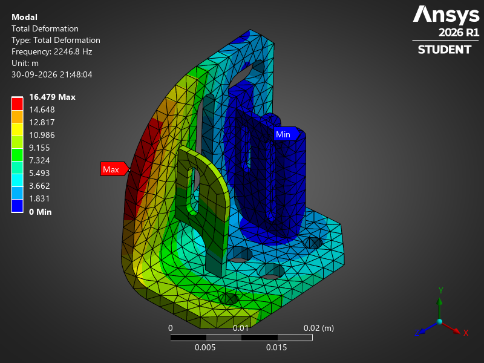

# 🚀 Agentic FEA: 3D Aerospace Bracket Modal Vibration Analysis via Ansys & Claude MCP

[](https://www.python.org/downloads/)
[](https://www.ansys.com/)
[-green.svg)](https://modelcontextprotocol.io/)
[](https://mechanical.docs.pyansys.com/)
[](LICENSE)

An end-to-end **Agentic AI Simulation Pipeline** that connects **Anthropic's Claude** directly to **Ansys Mechanical Enterprise** via the **Model Context Protocol (MCP)** and **PyMechanical**.

Instead of testing with basic textbook cantilever beams, this repository showcases a full industrial-grade finite element workflow on a **multi-component 3D Aerospace Structural Mounting Bracket**, extracting the first 6 natural vibration modes completely via automated Python orchestration.

---

## 📸 Simulation Results: Mode 1 Total Deformation



> **Figure 1**: Fundamental Mode 1 Total Deformation contour ($f_1 = 2,246.8\,\text{Hz}$) exported directly from Ansys Mechanical 2026 R1. Notice the vertical flange flexure and the structural load transfer to the 6 bolted mounting constraints.

---

## 📌 Architecture & Workflow


---

## 🧱 Finite Element Model Specifications

| Parameter | Value |
| :--- | :--- |
| **Component** | 3D Aerospace Mounting Bracket Assembly (`MidSurfaceBracket.agdb`) |
| **Material** | Structural Steel ($E = 200\,\text{GPa}$, $\nu = 0.30$, $\rho = 7850\,\text{kg/m}^3$) |
| **Finite Element Type** | 3D Solid Elements (Higher-Order Quadratic Formulation) |
| **Mesh Statistics** | **6,191 Nodes** \| **2,930 Elements** |
| **Interface Contacts** | Auto-generated bonded contact pairs between assembly components |
| **Boundary Conditions** | Fully clamped fixed supports applied across all **6 mounting bolt hole surfaces** |
| **Solver** | Ansys Block Lanczos Modal Eigensolver |
| **Vibration Range** | First 6 Natural Modes ($2.2\,\text{kHz} - 11.3\,\text{kHz}$) |

---

## 📊 Extracted Natural Frequencies Table

The Block Lanczos eigensolver extracted the following fundamental vibration modes:

| Mode | Natural Frequency (Hz) | Period (ms) | Dynamic Mode Characteristic |
| :---: | :---: | :---: | :--- |
| **1** | **2,246.79** | 0.4451 | **1st Fundamental Bending Mode** (Vertical flange flexure & tip deflection) |
| **2** | **3,556.12** | 0.2812 | **1st Torsional Mode** (Out-of-phase rib twisting) |
| **3** | **6,930.27** | 0.1443 | **2nd Transverse Bending Mode** (Lateral web sway) |
| **4** | **9,329.98** | 0.1072 | **Web Flange In-Plane Breathing Mode** (Expansion/contraction) |
| **5** | **9,940.81** | 0.1006 | **Coupled Torsion-Bending Harmonic** |
| **6** | **11,303.57** | 0.0885 | **High-Frequency Axial/Acoustic Resonance** |

### 💡 Key Engineering Takeaways:
- **Resonance Margin**: The lowest resonant frequency occurs at **2,246.8 Hz**, placing the structure well above typical mechanical vibration spectra (ground vehicles: $5-100\,\text{Hz}$, aero turbomachinery harmonics: $50-500\,\text{Hz}$).
- **Bolted Hole Load Sharing**: Fixing the 6 cylindrical hole faces prevents rigid body rotation and realistically simulates preloaded fastener behavior.

---

## 🗂️ Clean Repository Structure

```
Modal_Analysis/
├── assets/
│   └── bracket_mode1_contour.png          # High-resolution simulation contour
├── docs/
│   └── bracket_modal_analysis_report.md   # Comprehensive engineering report
├── mcp/
│   └── ansys_mcp_server.py                # Model Context Protocol server (Mechanical/Fluent/MAPDL)
├── models/
│   └── Aerospace_Bracket_Modal.mechdb     # Ready-to-open Ansys Mechanical database
├── examples/
│   └── cantilever_ml_surrogate/           # Benchmark: Random Forest ML surrogate on beam FEA
├── bracket_modal_analysis.py              # Main automated simulation script
├── requirements.txt                       # Clean Python dependencies
├── .gitignore                             # Ignore cache, logs, and Ansys scratch files
├── LICENSE                                # MIT License
└── README.md                              # Repository documentation
```

---

## ⚡ Quick Start

### 1. Prerequisites
- **Python 3.10+**
- **Ansys 2026 R1** (or 2025/2024 with PyMechanical) installed.

### 2. Installation
```bash
git clone https://github.com/vamshidharre/Modal_Analysis.git
cd Modal_Analysis
pip install -r requirements.txt
```

### 3. Run the Standalone Simulation
To execute the complete CAD import, meshing, contact generation, modal solve, and image export:

```bash
python bracket_modal_analysis.py
```

### 4. Open Directly in Ansys Mechanical
To inspect the 3D model, mesh, and animate the mode shapes in Ansys GUI, open the included database file:

```powershell
& "C:\Program Files\ANSYS Inc\v261\aisol\bin\winx64\AnsysWBU.exe" -file "models/Aerospace_Bracket_Modal.mechdb"
```
*(Or double-click `models/Aerospace_Bracket_Modal.mechdb`)*

---

## 🤖 Running via Claude Desktop & Claude Code (MCP)

To let Claude drive Ansys directly via natural language:

### Configure Claude Desktop
Add the Ansys MCP server to `%APPDATA%\Claude\claude_desktop_config.json`:

```json
{
  "mcpServers": {
    "ansys": {
      "command": "python",
      "args": ["<PATH_TO_REPO>/mcp/ansys_mcp_server.py"],
      "env": {
        "ANSYS_ROOT": "C:\\Program Files\\ANSYS Inc\\v261"
      }
    }
  }
}
```

### Configure Claude Code CLI
```bash
claude mcp add ansys python mcp/ansys_mcp_server.py
```

### Example Prompt to Claude:
> *"Launch an Ansys Mechanical session, load the bracket CAD, mesh with solid elements, clamp the 6 bolt holes, and solve the first 6 natural vibration frequencies."*

---

## 📜 License
This project is licensed under the [MIT License](LICENSE).

---

## 👤 Author
**Vamshidhar Reddy**  
- **GitHub**: [@vamshidharre](https://github.com/vamshidharre)  
- **LinkedIn**: [Vamshidhar Reddy](https://www.linkedin.com/in/vamshidhar-reddy-eng/)  
- **Portfolio**: [vamshidhar-portfolio.netlify.app](https://vamshidhar-portfolio.netlify.app/)

