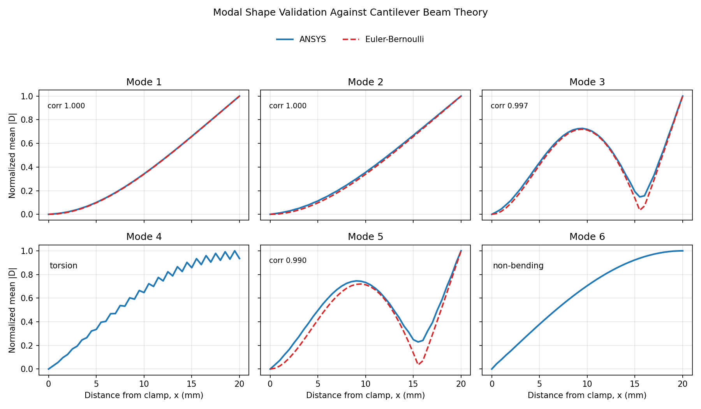

# 🔬 Beam Modal Analysis — ML-Accelerated Mode Shape Prediction

A machine learning pipeline that learns structural mode shapes from ANSYS finite element simulation data and predicts total deformation fields **in milliseconds** — replacing costly re-simulation with near-instant inference.

---

## 📌 Overview

Modal analysis determines the natural frequencies and mode shapes of a structure — critical for avoiding resonance-induced failures. Traditional FEA solvers (e.g., ANSYS) deliver high-fidelity results but can be computationally expensive for iterative design cycles.

This project trains a **Random Forest Regressor** on ANSYS-exported deformation data for a cantilever beam, building a surrogate model that maps **nodal coordinates + mode number → total deformation**. Once trained, the model produces predictions orders of magnitude faster than re-running the simulation.

---

## 🧱 Beam Geometry

| Parameter | Value    |
|-----------|----------|
| Length    | 20 mm    |
| Breadth   | 4 mm     |
| Height    | 2 mm     |
| Element   | Solid    |

The beam is modelled as a 3D solid, meshed in ANSYS and exported as `Beam_Mesh.stl`.

---

## 🗂️ Repository Structure

```
Modal_Analysis/
├── Beam.py            # ML training & inference pipeline
├── Beam_Mesh.stl      # 3D mesh geometry (STL format)
├── Mode1.txt          # ANSYS deformation data — Mode 1
├── Mode2.txt          # ANSYS deformation data — Mode 2
├── Mode3.txt          # ANSYS deformation data — Mode 3
├── Mode4.txt          # ANSYS deformation data — Mode 4
├── Mode5.txt          # ANSYS deformation data — Mode 5
├── Mode6.txt          # ANSYS deformation data — Mode 6
└── README.md          # Project documentation
```

---

## ⚙️ How It Works

### 1. Data Loading
Tab-separated ANSYS exports (`Mode1.txt` – `Mode6.txt`) are loaded and combined into a single dataset. Each file contains:

| Column              | Description                      |
|---------------------|----------------------------------|
| `Node Number`       | FEM node index                   |
| `X Location (m)`    | X coordinate of the node         |
| `Y Location (m)`    | Y coordinate of the node         |
| `Z Location (m)`    | Z coordinate of the node         |
| `Total Deformation (m)` | Resultant deformation at the node |

A `Mode` column (1–6) is appended to each record so the model can distinguish between different mode shapes.

### 2. Feature Engineering
- **Inputs (features):** `X`, `Y`, `Z`, `Mode`
- **Output (target):** `Total Deformation`

### 3. Model Training
A `RandomForestRegressor` (100 estimators) is trained on an 80/20 train-test split, leveraging all CPU cores for parallel fitting.

### 4. Evaluation
Model accuracy is measured using:
- **Mean Squared Error (MSE)**
- **R² Score** (coefficient of determination)

### 5. Inference
After training, single-point predictions can be made by providing any (X, Y, Z, Mode) input — enabling rapid "what-if" queries across all six mode shapes.

---

## 🔬 Validation & Limitations

The bending mode shapes were checked against Euler-Bernoulli cantilever beam theory using only the normalized axial deformation profile. Modes 1, 2, 3, and 5 match the analytical cantilever shapes with correlation ≥ 0.99, which independently validates the FEM deformation export shape trends.

| Comparison | corr | RMS (normalized) |
|------------|------|------------------|
| Mode 1 vs EB 1st-bending | +1.0000 | 0.0024 |
| Mode 2 vs EB 1st-bending | +0.9999 | 0.0127 |
| Mode 3 vs EB 2nd-bending | +0.9975 | 0.0320 |
| Mode 5 vs EB 2nd-bending | +0.9899 | 0.0732 |



The machine learning model is strong for in-distribution interpolation: a random 80/20 split gives R² ≈ 0.996. However, holding out an entire mode gives poor or negative R² for several modes, so the current model should be understood as a fast field surrogate over the six computed mode shapes, not a predictor of new unseen modes.

Future validation would benefit from exporting directional displacement components (`Ux`, `Uy`, `Uz`) to decompose bending and torsion, plus natural frequencies in Hz to compare against `f_n = (β_nL)^2/(2π)·sqrt(EI/ρAL^4)`.

---

## 🚀 Getting Started

### Prerequisites
- Python 3.8+
- pip

### Installation
```bash
# Clone the repository
git clone https://github.com/vamshidharre/Modal_Analysis.git
cd Modal_Analysis

# Create a virtual environment (recommended)
python -m venv .venv
source .venv/bin/activate        # Linux/macOS
# .venv\Scripts\activate         # Windows

# Install dependencies
pip install pandas numpy scikit-learn
```

### Run
```bash
python Beam.py
```

### Expected Output
```
Loading data for all modes...
 - Loaded Mode 1
 - Loaded Mode 2
 - Loaded Mode 3
 - Loaded Mode 4
 - Loaded Mode 5
 - Loaded Mode 6

Total rows in dataset: 6462

Training the Multi-Mode Machine Learning model...
Training Complete!
Mean Squared Error (MSE) on Test Data: 1.01613573
Accuracy (R-Squared Score): 99.63%

--- INFERENCE TEST ---
Node at X=0.001, Y=0, Z=0.019 -> Predicted Mode 1 Deformation: 0.250999 m
Node at X=0.001, Y=0, Z=0.019 -> Predicted Mode 2 Deformation: 0.496889 m
```

---

## 🛠️ Tech Stack

| Tool / Library  | Purpose                        |
|-----------------|--------------------------------|
| ANSYS Mechanical| FEA simulation & data export   |
| Python          | Core language                  |
| pandas          | Data loading & manipulation    |
| NumPy           | Numerical operations           |
| scikit-learn    | Random Forest model & metrics  |

---

## 🔮 Future Scope

- Extend to additional beam geometries and boundary conditions
- Incorporate material property variations as features
- Experiment with gradient-boosted models (XGBoost, LightGBM), neural networks, or physics-informed ML
- Add 3D deformation visualisation using `pyvista` or `matplotlib`
- Deploy as an API for real-time structural queries

---

## 📄 License

This project is open source and available under the [MIT License](LICENSE).

---

## 👤 Author

**Vamshidhar Reddy**

- GitHub: [@vamshidharre](https://github.com/vamshidharre)
